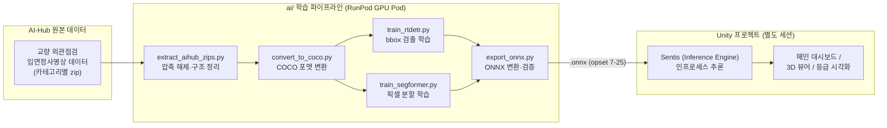

# BridgeSense DT — AI 모델 개발 기획서

> 작성일: 2026-07-30
> 범위: `ai/` 디렉토리 — AI-Hub 데이터 기반 교량 결함 탐지/분할 모델 학습 및 ONNX 익스포트
> 마감: 2026-08-27 오픈소스 개발자대회 출품

---

## 1. 개요

**BridgeSense DT**는 극락교 등을 포함한 교량 결함 데이터와 AI 모델을 기반으로, 사용자가 Unity
대시보드에 업로드하는 **임의의 교량 균열 이미지와 교량 기본정보**를 분석하는 교량 안전점검
디지털 트윈이다. 즉 학습 데이터에 극락교가 포함될 수는 있지만, 모델이 극락교 전용으로 만들어지는
것은 아니며 실제 서비스 시점에는 사용자가 업로드하는 임의의 교량을 대상으로 동작해야 한다.
Unity로 제작된 3D 뷰어/대시보드 위에서 교량 부재별 안전등급을 시각화하며, 그 등급 판정의
입력값이 되는 **손상(결함) 탐지·분할 AI 모델**을 만드는 것이 이 기획서가 다루는 범위다.

- **입력**: 사용자가 Unity 대시보드에 업로드하는 교량 외관점검 이미지 + 교량 기본정보
- **출력**: 결함 종류(bbox) + 균열 픽셀 마스크
- **최종 소비처**: Unity Sentis(Inference Engine) — 실시간 추론 서버 없이 인프로세스 실행

전체 프로젝트(Unity UI/3D 뷰어)는 이미 별도 세션에서 완료되어 있으며, 이 문서는 **AI 학습
파이프라인 단독**의 아키텍처를 정리한다.

---

## 2. 전체 시스템 아키텍처



**하지 않는 것**: 실시간 추론 API 서버(FastAPI/Flask 등)는 만들지 않는다. 추론은 전적으로 Unity
Sentis가 익스포트된 `.onnx`를 인프로세스로 실행한다.

---

## 3. 기술 스택

| 영역 | 선택 | 비고 |
|---|---|---|
| 언어/런타임 | Python 3.11.10 | RunPod 템플릿 기준 (계획 초기 가정이던 3.10.11과 다름, 실측값) |
| ML 프레임워크 | PyTorch 2.4.1+cu124 | 컨테이너 시스템 site-packages에 사전 설치됨 |
| 모델 학습 | HuggingFace `transformers` 5.14.1, `accelerate` | Trainer API 기반 |
| 검출 모델 | RT-DETR v2 (`PekingU/rtdetr_v2_r18vd`) | Apache 2.0, bbox 검출 |
| 분할 모델 | SegFormer MiT-B2 (`nvidia/mit-b2`) | Apache 2.0, 균열 픽셀 마스크 |
| 데이터 포맷 | COCO (bbox + segmentation polygon) | `pycocotools`로 로드 |
| 평가 | HuggingFace `evaluate`, `tensorboard` | 학습 로그·메트릭 |
| 모델 배포 포맷 | ONNX (opset 7~25) | `onnx`, `onnxruntime`로 변환·검증 |
| 추론 런타임 | Unity Sentis (`com.unity.ai.inference`) | Unity 쪽, 이 세션 범위 밖 |
| GPU 인프라 | RunPod GPU Pod, NVIDIA RTX PRO 4000 Blackwell 24GB | Volume Disk 200GB 사용 |
| 장시간 학습 관리 | tmux | SSH 연결 끊김에도 학습 프로세스 유지 |
| 버전 관리 | Git (`develop-AI` 브랜치), sparse-checkout | 대용량 데이터·체크포인트는 `.gitignore` 처리 |

---

## 4. 인프라 아키텍처 (RunPod 특이사항)

RunPod Pod는 파일시스템이 두 종류로 나뉘며, 이 구분을 무시하면 작업 환경이 통째로 날아간다.

| 마운트 | 타입 | 영속성 | 실제 내용물 |
|---|---|---|---|
| `/` (홈 디렉토리 포함) | `overlay` (컨테이너 디스크) | **휘발성** — Pod 재시작/재할당 시 초기화 | `~/.claude`, `~/.vscode-server`(익스텐션), 전역 pip 패키지(`/usr/local/lib/python3.11/dist-packages`), `tmux` 등 apt 패키지 |
| `/workspace` | `mfs` 네트워크 볼륨 (Volume Disk) | **영속** | 프로젝트 git 저장소, `data/`, 학습 산출물, venv |

**대응 방식**:
1. Python 의존성 → `/workspace/.venv` (venv, `--system-site-packages`로 기존 torch 재사용)
2. VS Code 확장·설정(`~/.vscode-server/{extensions,data}`) → `/workspace/.pod_home/`로 이전 후 심볼릭 링크
3. Claude Code 설정·메모리(`~/.claude`, `~/.claude.json`) → 동일하게 `/workspace/.pod_home/`로 이전 후 심볼릭 링크
4. 재접속 시 복원 스크립트: `/workspace/scripts/bootstrap_env.sh`
   - tmux 설치 확인, venv 존재 확인, 심볼릭 링크 복원을 멱등적으로 재실행
   - **주의**: RunPod의 "Container Start Command"에 이 스크립트만 단독으로 넣으면 기본 `/start.sh`(nginx/SSH/jupyter 기동 + `sleep infinity`)를 통째로 대체해버려 SSH가 뜨지 않고 컨테이너가 즉시 종료 → 무한 initializing 루프에 빠진다. 자동화하려면 반드시
     `bash -c "bash /workspace/scripts/bootstrap_env.sh; exec /start.sh"` 형태로 체이닝할 것.
     현재는 재접속 직후 터미널에서 수동 실행하는 방식을 채택 중.

---

## 5. 데이터 파이프라인

### 5.1 원본 데이터

- **출처**: AI-Hub "교량 외관점검 입면정사영상 데이터"(040)
- **구조**: `Training`/`Validation` 스플릿 × `01.원천데이터`(jpg)/`02.라벨링데이터`(json) × 결함 카테고리별 zip
- **규모**: 전체 약 27GB, **총 420,074장** (`data/aihub/260730_FullData/`에 업로드 완료). 구조 확인용
  소규모 샘플 244장은 검증 완료 (`data/aihub_extracted/`)
- **재질별 분포**:

  | 재질 | 장수 | 비율 |
  |---|---|---|
  | 콘크리트 | 174,788 | 41.6% |
  | 아스팔트 | 146,459 | 34.9% |
  | 정상데이터 | 98,393 | 23.4% |
  | 강재 | 434 | 0.1% |

- **교량 종별(뷰 코드) 분포**: BG 0.25%, IG 26.61%, PF 0.22%, PG 16.71%, RS 0.65%, SB 27.94%,
  SP 0.46%, UN 26.48% — SB/IG/UN/PG 4종이 전체의 97.7%를 차지하고 BG/PF/RS/SP는 합쳐서 1.6% 미만.
  사용자가 업로드할 임의의 교량이 이 4종 형식에서 벗어나면(희소 종별) 검출 성능이 상대적으로
  떨어질 수 있음을 감안해야 한다.
- **라벨 스키마** (LabelMe 스타일, 실측 확인 완료):
  ```json
  {
    "meta_info": {"ID": ..., "NAME": "교량명", "TYPE": "교량종류코드", "GRADE": "교량등급"},
    "shapes": [{"label": "SteelDefect", "points": [[x, y], ...], "shape_type": "polygon"}],
    "imagePath": "st158UN0P03_000107.jpg",
    "imageHeight": 512,
    "imageWidth": 512
  }
  ```

### 5.2 결함 클래스 (9종 + 정상데이터)

파일명 접두 2글자 코드로 클래스를 판별한다 (`shapes[].label` 문자열은 비일관적이라 신뢰하지 않음).

| 접두 | 클래스 | 재질 |
|---|---|---|
| `co` | 콘크리트_균열 | 콘크리트 |
| `ef` | 백태 | 콘크리트 |
| `le` | 누수 | 콘크리트 |
| `sp` | 박락 | 콘크리트 |
| `ex` | 철근_노출 | 콘크리트 |
| `st` | 강재_부식 | 강재 |
| `pa` | 도장_박리 | 강재 |
| `as` | 아스팔트_균열 | 아스팔트 |
| `po` | 함몰 | 아스팔트 |
| `no` | (정상데이터, 검출 카테고리 아님) | — 네거티브 샘플로만 사용 |

### 5.3 처리 흐름

```
data/aihub/260730_FullData/**/*.zip          (카테고리별 원본 zip, Training+Validation)
        │  extract_aihub_zips.py
        ▼
data/aihub_extracted/{Training,Validation}/{원천데이터,라벨링데이터}   (평탄화된 원본)
        │  convert_to_coco.py
        ▼
data/coco_format/{train,val}.json             (COCO: images / annotations / categories)
        │  dataset.py (HF Dataset 로더)
        ▼
train_rtdetr.py ─┐
train_segformer.py ─┴─▶ checkpoints (HuggingFace Trainer 산출물, /workspace/ai/checkpoints/, git 미포함)
```

### 5.4 클래스 불균형 및 대응 전략

강재(강재_부식, 도장_박리) 클래스가 434장(전체의 0.1%)뿐이라 그대로 학습하면 두 클래스는 사실상
학습이 안 될 수준의 심각한 불균형이다. 대응 방침:

1. **1차(즉시 적용)**: 강재 이미지 오버샘플링 + loss에 클래스별 가중치 부여. 추가 데이터 없이
   구현 가능한 표준 기법이라 `train_rtdetr.py`/`train_segformer.py`에 기본으로 포함한다.
2. **2차(보강 예정)**: AI-Hub "건물 균열 탐지 이미지" 데이터셋 활용. 이름과 달리 교량·댐·강구조물
   대상 강재(강재 손상, 도장 손상) 이미지가 **약 155,000건** 포함되어 있는 것으로 확인됨 — 기존
   계획(6장 데이터 우선순위)에서 "증강 전용, 도메인 다름"으로 분류했던 것을 정정, 강재 클래스에
   한해서는 도메인이 상당히 겹치는 실질적 보강 데이터로 재평가한다. 단 라벨 스키마가 메인
   데이터셋(LabelMe 스타일 폴리곤)과 동일한지는 실제로 열어서 확인 필요 (13장 열린 이슈 참고).

---

## 6. 모델 아키텍처

두 모델을 분리해서 학습하는 이유: **검출(어디에 있는가, bbox)**과 **분할(정확히 어떤 픽셀인가,
mask)**은 목적이 다르고, RT-DETR는 인스턴스 단위 bbox에, SegFormer는 조밀한 픽셀 분류에 최적화되어
있어 하나로 합치는 것보다 각자 전용 모델을 쓰는 편이 정확도·학습 난이도 면에서 유리하다.

| 모델 | 역할 | 베이스 체크포인트 | 학습 데이터 |
|---|---|---|---|
| RT-DETR v2 | 9종 결함 bbox 검출 | `PekingU/rtdetr_v2_r18vd` | COCO bbox 어노테이션 |
| SegFormer MiT-B2 | 균열 등 픽셀 단위 분할 마스크 | `nvidia/mit-b2` | COCO segmentation polygon → mask 변환 |

데이터 우선순위: 1) 교량 외관점검 입면정사영상 데이터(메인) 2) SOC 시설물 균열패턴 이미지(보강용)
3) 건물 균열 탐지 이미지 — **강재(강재 손상/도장 손상) 클래스 보강용으로 재평가**(약 155,000건,
교량·댐·강구조물 대상 포함 확인됨, 5.4절 참고). 그 외 콘크리트/아스팔트 도메인은 여전히 메인
데이터셋으로 충분해 이 보조 데이터셋은 강재 보강 목적에 한정해서 사용한다.

---

## 7. 학습 파이프라인 운영 방식

1. 소규모 샘플(244장, 이미 COCO 변환 완료)로 파이프라인이 끝까지 도는지부터 검증 — **정확도보다
   엔드투엔드가 도는 것이 우선** (마감이 촉박하므로)
2. 전체 데이터(27GB) 변환 및 확장
3. `tmux new -s train` 세션 안에서 `train_rtdetr.py` 실행 — SSH 끊김에도 학습 유지
4. 짧게(예: 1 epoch, 서브셋) 먼저 돌려 파이프라인 검증 → 이상 없으면 본 학습으로 확대
5. TensorBoard로 로그 모니터링 (`tensorboard --logdir ...`)
6. 비용 관리: 장시간 자리 비울 때 Pod을 Stop할지 사용자에게 먼저 확인 (Volume Disk는 유지, GPU 과금만 중단)

### 예상 학습 시간 (참고용 추정치, RTX PRO 4000 Blackwell 24GB / 512×512 / 총 420,074장 기준)

| 모델 | epoch당 예상 시간 | 10~20 epoch 총 시간 |
|---|---|---|
| RT-DETR v2 (R18) | 약 1.4~2.8시간 | 약 14~56시간 (0.6~2.3일) |
| SegFormer MiT-B2 | 약 2.1~3.5시간 | 약 21~70시간 (0.9~2.9일) |

이론적 추정치라 오차가 클 수 있음 — 244장 스모크 테스트에서 실측한 step당 시간으로 반드시
재검증할 것. 강재 오버샘플링을 적용하면 실질 epoch당 이미지 수가 늘어나 위 추정보다 다소 길어질
수 있다.

---

## 8. ONNX 익스포트 & Unity Sentis 연동 계약

- **opset 버전**: 7~25 범위 준수 (Unity Sentis `com.unity.ai.inference` 확인된 지원 범위)
- **입출력 텐서**: 이름·shape을 고정하고 `export/model_io_spec.md`에 문서화
- **검증**: 익스포트 후 `onnxruntime` 추론 결과를 PyTorch 원본 출력과 반드시 대조
- **보관**: 완성된 `.onnx`는 HuggingFace Hub(CC BY 4.0) 또는 `/workspace/models/`에 버전 태그와 함께 보관 (git에는 커밋하지 않음)

---

## 9. 디렉토리 구조

```
ai/
├── CLAUDE.md                     # 이 디렉토리 작업 컨텍스트 (세션 규칙)
├── docs/
│   └── AI_PIPELINE_PLAN.md       # 이 문서
├── requirements.txt
├── data_prep/
│   ├── extract_aihub_zips.py     # 🔲 신규 — zip 일괄 압축 해제
│   ├── convert_to_coco.py        # ✅ 작성 완료 — 실 스키마 반영, 소규모 샘플 검증됨
│   ├── verify_dataset.py         # 🔲 신규(권장) — 전체 데이터 품질 자동 점검
│   └── extract_bridge_spec.py    # 🔲 미작성, 후순위 — 국토부 현황조서 → 교량별 기본정보 JSON
├── train/
│   ├── train_rtdetr.py           # 🔲 신규, 최우선 — RT-DETR v2 파인튜닝
│   ├── train_segformer.py        # 🔲 신규 — SegFormer 파인튜닝
│   └── dataset.py                # 🔲 신규(선택) — 공통 COCO Dataset 로더
└── export/
    ├── export_onnx.py            # 🔲 신규 — ONNX 변환
    ├── verify_onnx.py            # 🔲 신규(export_onnx.py에 통합 가능) — 출력 일치 검증
    └── model_io_spec.md          # 🔲 문서 — 입출력 텐서 계약 문서
```

---

## 10. 스크립트 상세 목록

| 스크립트 | 입력 | 출력 | 상태 |
|---|---|---|---|
| `extract_aihub_zips.py` | `data/aihub/260730_FullData/**/*.zip` | `data/aihub_extracted/{Training,Validation}/{원천데이터,라벨링데이터}` | 🔲 미작성 |
| `convert_to_coco.py` | 위 출력 (이미지 dir, 라벨 dir) | `data/coco_format/{train,val}.json` | ✅ 완료 (Training 244장 샘플 검증됨) |
| `verify_dataset.py` | COCO json + 이미지 dir | 콘솔 리포트(클래스 분포, 누락/손상 이미지) | 🔲 미작성 |
| `train_rtdetr.py` | `train.json`/`val.json` | 체크포인트(`ai/checkpoints/rtdetr/`) | 🔲 미작성 |
| `train_segformer.py` | `train.json`/`val.json` (mask 변환) | 체크포인트(`ai/checkpoints/segformer/`) | 🔲 미작성 |
| `dataset.py` | COCO json | HuggingFace/torch Dataset 객체 | 🔲 미작성 |
| `export_onnx.py` | 학습 체크포인트 | `.onnx` (opset 7-25) | 🔲 미작성 |
| `verify_onnx.py` | `.onnx` + 체크포인트 | 출력 일치 여부 리포트 | 🔲 미작성 |
| `extract_bridge_spec.py` | `data/2026 도로 교량 및 터널 현황조서....xls` | 교량별 기본정보 JSON (사용자 업로드 시 이름/현황조서 매칭용, 극락교 한정 아님) | 🔲 미작성, 후순위 |

---

## 11. 우선순위 및 일정 (2026-08-27 마감 역산)

1. **[완료]** 전체 데이터 업로드 완료 (420,074장)
2. `extract_aihub_zips.py` → 전체 데이터 압축 해제
3. `convert_to_coco.py`로 전체 train/val COCO 변환 (+ `verify_dataset.py`로 품질 확인)
4. `train_rtdetr.py` 작성 (오버샘플링 + 클래스 가중치 포함) → 소규모 서브셋으로 스모크 테스트 → 본 학습
5. `train_segformer.py` 작성 → 동일 절차
6. 건물 균열 탐지 이미지에서 강재 서브셋(155,000건) 확인·정제 후 학습 데이터에 보강 편입
7. `export_onnx.py` / `verify_onnx.py` 작성 → 두 모델 ONNX 변환·검증
8. Unity 세션으로 인계 (`.onnx` + `model_io_spec.md`) → Sentis 연동

**우선순위 원칙**: 완벽한 정확도보다 엔드투엔드 파이프라인이 끝까지 도는 것을 먼저 검증한다.
RT-DETR(검출)이 SegFormer(분할)보다 우선순위가 높다 — 등급 판정에 더 직접적으로 쓰이기 때문.

---

## 12. 하지 않는 것 (Non-goals)

- 실시간 추론 서버(FastAPI, Flask 등) 구축
- Unity/C#/UI 코드 수정 (별도 프로젝트·별도 세션)
- AI-Hub 원본 데이터, 체크포인트(.pt/.pth/.safetensors), ONNX 산출물의 git 커밋
- 완벽한 정확도를 위한 장기 하이퍼파라미터 튜닝 (마감 우선, 일단 파이프라인 검증 우선)

---

## 13. 열린 이슈

- SegFormer 학습용 마스크 변환 방식(폴리곤 → 픽셀 마스크 rasterize) 세부 구현 미정
- Validation 스플릿을 AI-Hub 제공 그대로 쓸지, 클래스 불균형(정상데이터 비율 등) 고려해 재분할할지 결정 필요
- "건물 균열 탐지 이미지" 데이터셋의 강재 서브셋(155,000건) 라벨 스키마가 메인 데이터셋과 동일한
  LabelMe 폴리곤 형식인지 미확인 — 실제로 열어서 확인 후 `convert_to_coco.py` 재사용 가능 여부 판단 필요
- 희소 교량 종별(BG/PF/RS/SP, 합계 1.6% 미만)에 대한 일반화 성능 — 사용자가 이런 종별 교량을
  업로드할 경우 검출 품질이 떨어질 수 있음, 별도 검증셋으로 확인 필요
